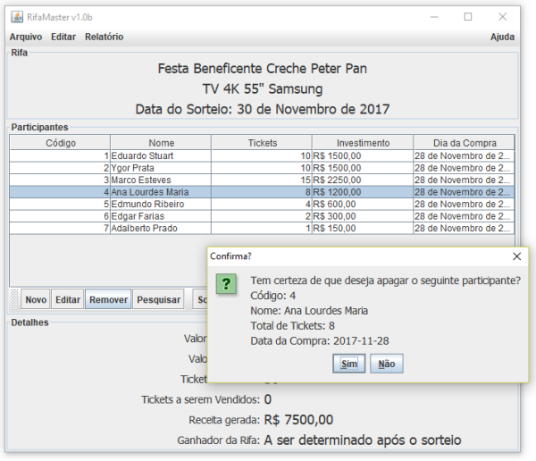

# RifaMaster
## Gerenciador de Contribuições Voluntárias com a Possibilidade de Resgate de Prêmios Mediante Sorteio

 

### Proposta
Idealizado com o objetivo de demonstrar o desenvolvimento de um sistema completo que empregrasse a **Programação Orientada a Objetos**, o padrão de arquitetura **MVC** (*Model-View-Controller*) e uma interface gráfica que fosse intuitiva e amigável, **RifaMaster** é um sistema que foi apresentado para o público no segundo semestre do ano de 2017, nas dependências da **Universidade Veiga de Almeida ─ Campus Centro**.

Todo o sistema foi desenvolvido usando somente as bibliotecas nativas do **JAVA 8**.

### Como executá-lo?
Por ter como objetivo ser um projeto acadêmico, **RifaMaster** foi desenvolvido usando o [BlueJ](https://www.bluej.org/). 

Sua distribuição tem como função auxiliar os demais alunos interessados em tópicos como **Programação Orientada a Objetos**, **Algoritmos** e **Java**, e que gostariam de poder estudar e alterar um projeto 100% funcional.

Para executá-lo, será preciso completar os seguintes passos:
  1. Transferir e instalar a versão mais recente do [BlueJ](https://www.bluej.org/)
  2. Ao executar o **BlueJ**, ative o menu **Projeto** -> **Abrir Projeto** e acesse a pasta onde estão armazenados os arquivos do **RifaMaster** (escolha a pasta onde se encontra o arquivo **package.bluej**)
  3. Clique no botão **Compilar**, presente na barra lateral esquerda do **BlueJ**
  4. Assim que todas as classes forem compiladas, clique com o botão direito do *mouse* na classe **Rifa** e ative o menu **new Rifa()** para iniciar a aplicação. 

### Código-fonte
Todas as classes estão fartamente comentadas, detalhando as técnicas usadas e os algoritmos empregados.

Para estudar a sua estrutura, inicie seus estudos com a classe **Rifa.java**.

### Apresentação
Detalhes completos da apresentação podem ser conferidos a partir do seguinte documento:
[RifaMaster: Apresentação em PDF](https://github.com/eduardo-stuart/RifaMaster/blob/master/RifaMaster.pdf)

### Sobre
Desenvolvido por **Eduardo Stuart**, você pode entrar em contato comigo via [LinkedIn](https://www.linkedin.com/in/eduardo-stuart/).   